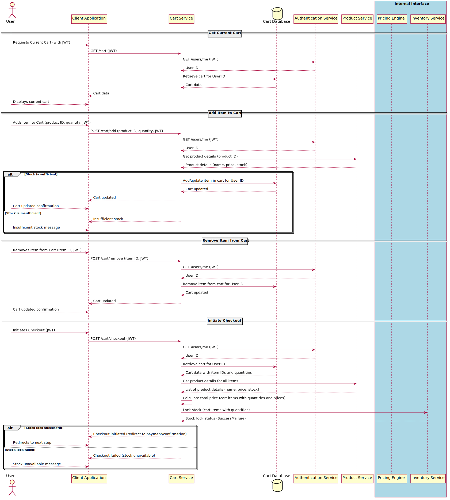

Processes orders post-checkout.

**Endpoints:**

- `POST /orders` – Create order (from checkout)
- `GET /orders` – List user’s orders
- `GET /orders/{id}` – Order details
- `PUT /orders/{id}/status` – Update status (admin)

**Internal interface:**

- Save new order
- Update status (e.g., paid, shipped)
- Notify user (event)

