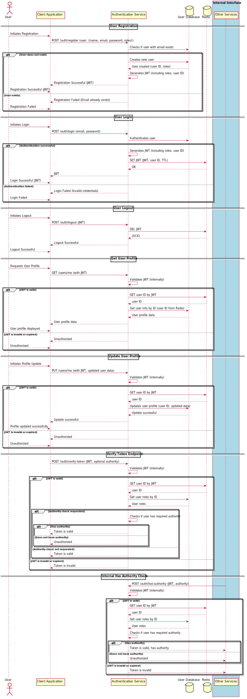

Handles authentication, registration, and user profile management.

**Endpoints:**

- `POST /auth/register`: Registers a new user.
- `POST /auth/login`: Logs in a user, returns a token, and stores the token in Redis with a Time-To-Live (TTL).
- `POST /auth/logout`: Logs out a user by deleting the token from Redis.
- `GET /users/me`: Retrieves the current user's profile.
- `PUT /users/me`: Updates the current user's profile.
- `POST /auth/verify-token`: Validates a token against the tokens stored in Redis.
- `POST /auth/has-authority`: (Internal Service) Validates a token and checks if the token's user has the authority specified in the request header.

**Internal Interface (for other services):**

- Token Validation
- User Information Retrieval (by ID or email)

**User Object:**

```json
{
  "name": "...",
  "email": "...",
  "password": "...",
  "roles": ["ADMIN", "USER"]
}
```


