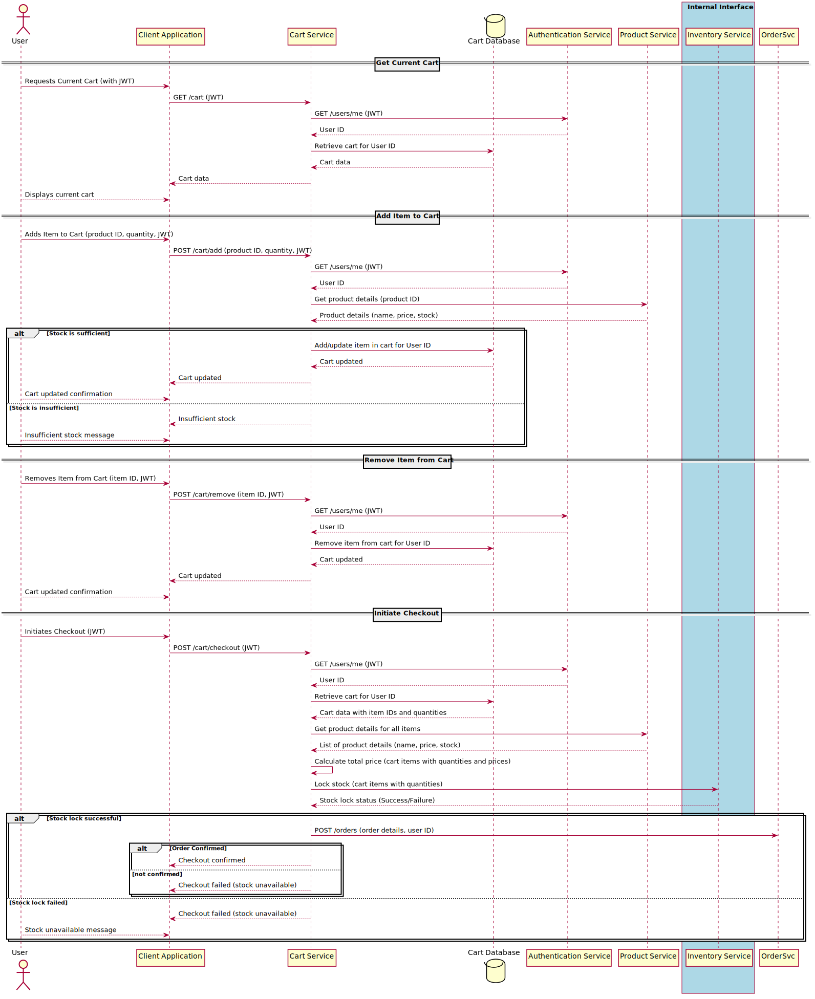

Handles user carts and checkout session.

**Endpoints:**

- `GET /cart` – Get current cart
- `POST /cart/add` – Add item to cart
- `POST /cart/remove` – Remove item from cart
- `POST /cart/checkout` – Initiate checkout

**Authentication:**

- All endpoints require authentication via a user token.
- The `user_id` is extracted from the token using the `auth-service`'s `/users/me` endpoint.
- This `user_id` is used to associate the cart with the correct user.

**Data Flow:**

- This service does not handle pricing. Pricing information is managed by the `product-service`.
- The cart only stores product IDs and quantities.

**Checkout Flow:**

- The `POST /cart/checkout` endpoint initiates the checkout process.
- The service interacts with other services (e.g., payment service, order service - _to be defined_) to complete the checkout.

