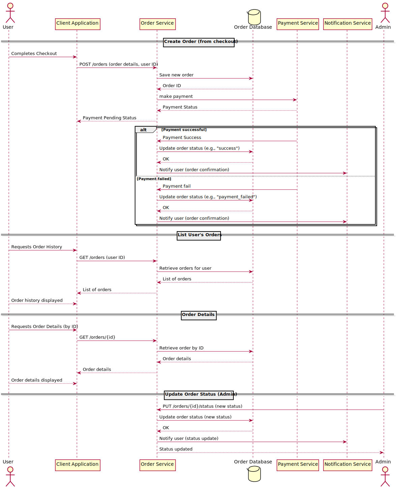

Handles payment processing.

**Endpoints:**

- `POST /payments` – Process a payment
- `GET /payments/{id}` – Payment details

**Internal interface:**

- Charge user
- Record transaction
- Verify transaction
- Notify order service (event)

