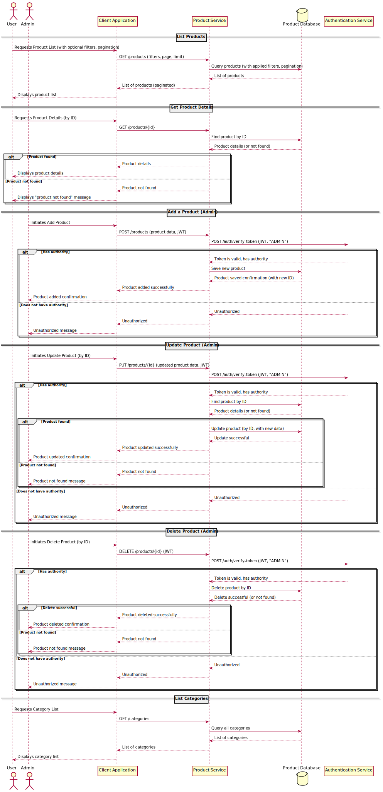

**Endpoints:**

- `GET /products` – List products (with filters, pagination)
- `GET /products/{id}` – Product details
- `POST /products` – Add a product (admin)
- `PUT /products/{id}` – Update product (admin)
- `DELETE /products/{id}` – Delete product (admin)
- `GET /categories` – List categories

**Data Models:**

**Product:**

```json
{
  "id": "uuid",
  "name": "string",
  "description": "string",
  "price": "number",
  "category_id": "uuid",
  "image_url": "string",
  "created_at": "timestamp",
  "updated_at": "timestamp"
}
```

### Product APIs


